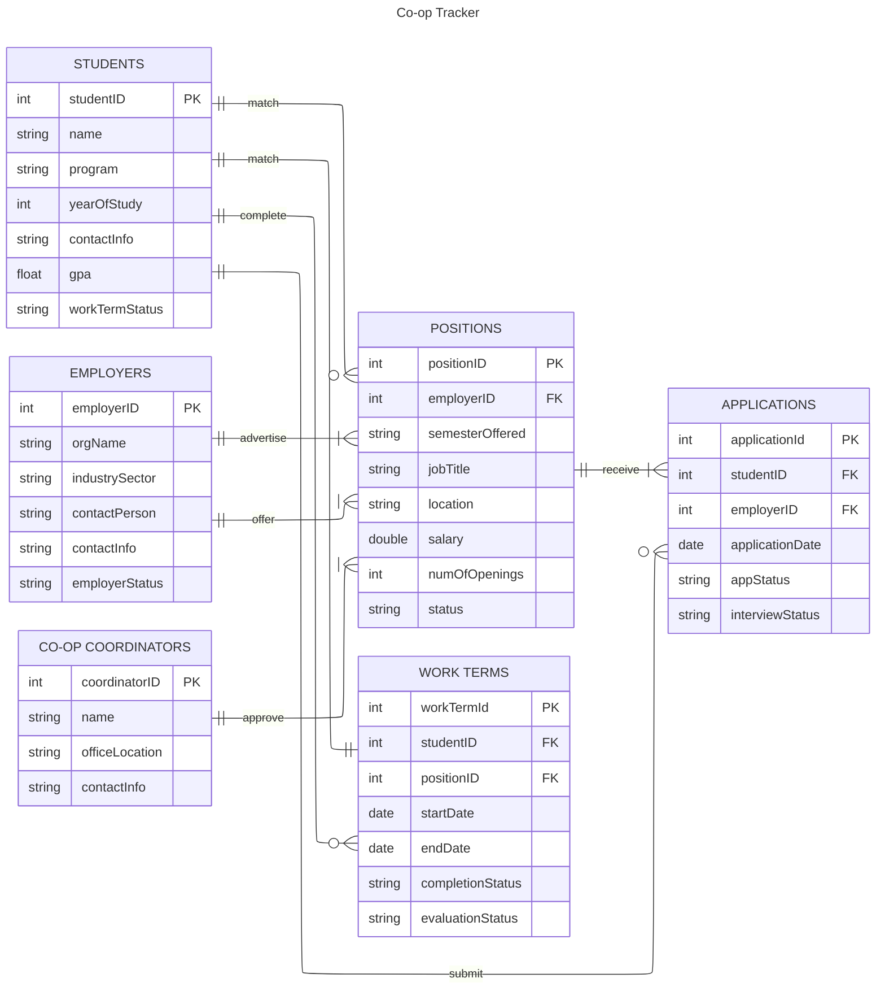

```mermaid
---
config:
    layout: elk
title: Co-op Tracker
---

erDiagram
direction LR
APPLICATIONS {
    int applicationId PK
    int studentID FK
    int employerID FK
    date applicationDate
    string appStatus
    string interviewStatus
}
STUDENTS {
    int studentID PK
    string name
    string program
    int yearOfStudy
    string contactInfo
    float gpa
    string workTermStatus
}
EMPLOYERS {
    int employerID PK
    string orgName
    string industrySector
    string contactPerson
    string contactInfo
    string employerStatus
}
POSITIONS {
    int positionID PK
    int employerID FK
    string semesterOffered
    string jobTitle
    string location
    double salary
    int numOfOpenings
    string status
}
"CO-OP COORDINATORS" {
    int coordinatorID PK
    string name
    string officeLocation
    string contactInfo
}
"WORK TERMS" {
    int workTermId PK
    int studentID FK
    int positionID FK
    date startDate
    date endDate
    string completionStatus
    string evaluationStatus
}
STUDENTS ||--o{ APPLICATIONS : submit
STUDENTS ||--o{ "WORK TERMS" : complete
STUDENTS ||--|| "WORK TERMS" : match
STUDENTS ||--o{ POSITIONS : match
EMPLOYERS ||--|{ POSITIONS : advertise
EMPLOYERS ||--|{ POSITIONS : offer
POSITIONS ||--|{ APPLICATIONS : receive
"CO-OP COORDINATORS" ||--|{ POSITIONS : approve
```

